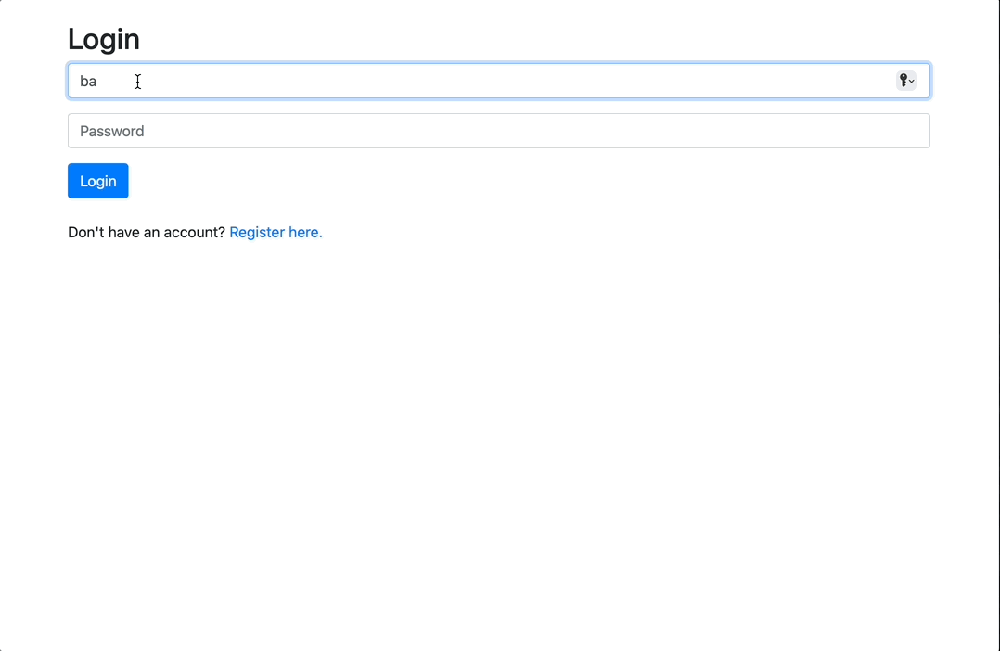

# Mail

[](https://www.python.org/)
[](https://www.djangoproject.com/)
[](https://getbootstrap.com/)
[](LICENSE)


**Interactive Single-Page Email Client**

A fully interactive single-page email client built with Django and JavaScript. 
The app demonstrates seamless API integration, dynamic UI updates, and smooth user interaction — 
all without refreshing the page.

## Demo

### Application Walkthrough



### Video Overview

[](https://youtu.be/Z8J4OFJ-9aI)

## Features

- **Single-Page Design**: All interactions happen dynamically without full-page reloads.
- **Inbox, Sent, and Archive Views**: Navigate through email categories smoothly.
- **Compose Emails**: Draft and send emails using a responsive form.
- **Read & Reply**: Open emails, mark them as read/unread, and reply inline.
- **Archive & Unarchive**: Organise messages effortlessly with one click.
- **Asynchronous Requests**: Built entirely on API calls for instant updates.
- **Modern UI/UX**: Clean, minimal interface focused on usability.

## Technologies Used

- **Backend**: Django (RESTful API)
- **Frontend**: JavaScript (Fetch API), HTML, CSS
- **Database**: SQLite (default, easily switchable to PostgreSQL/MySQL)
- **Deployment**: Gunicorn, Whitenoise

## Setup

1. Clone this repository:

   ```bash
   git clone https://github.com/AmirMahdi-Tizchang/cs50w-mail.git
   cd cs50w-mail
   ```

2. Install dependencies:

   ```bash
   pip install -r requirements.txt
   ```

3. Apply migrations:

   ```bash
   python manage.py migrate
   ```

4. Run the server:

   ```bash
   python manage.py runserver
   ```

5. Visit `http://127.0.0.1:8000` in your browser.

## Project Structure

```
mail/
├── mail/            # Core Django app
|── project3/        # project's Settings
├── static/          # CSS, JS
├── templates/       # HTML templates
└──manage.py
docs/            # Demo GIFs, screenshots
README.md
requirements.txt
LICENSE
```

## License

This project is licensed under the MIT License - see the [LICENSE](LICENSE) file for details.

## Contact

AmirMahdi Tizchang – [GitHub](https://github.com/AmirMahdi-Tizchang)
